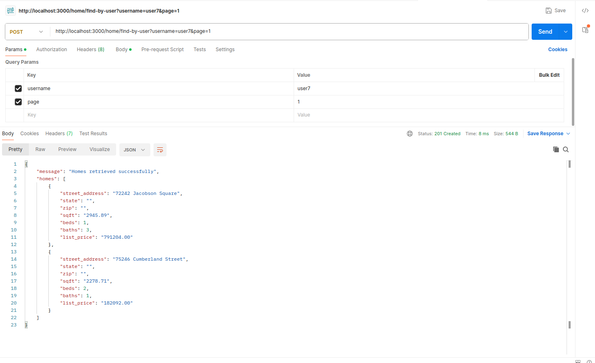

## Folder Structure
```plaintext
backend/
├── package.json
└── src/
    ├── home/
    │   ├── home.controller.ts
    │   ├── home.entity.ts
    │   └── home.service.ts
    ├── user/
    │   ├── user.controller.ts
    │   ├── user.entity.ts
    │   └── user.service.ts
    ├── user_home/
    │   └── user_home.entity.ts
    ├── db.env
    └── main.ts
```

## Running the Backend
1. **Clone the Repository**:  git clone https://github.com/ShwetaPokale/full_stack_assessment_skeleton.git
2. Checkout branch: git checkout shweta-develop
3. cd full_stack_assessment_skeleton/backend
4. **Install Dependencies:** npm install
5. Run the Docker Container for the Database:  docker-compose -f docker-compose.final.yml up --build -d
6. **Configure Environment:** Edit the db.env file in the backend/ directory with your db credentials.
7. **Start the Backend:** npm run start
- The backend will run on port 3000. Ensure your frontend application uses a different port.
8. **Database Initialization**
- After running the backend, tables will be created automatically. Use the 99_final_db_dump.sql file to insert data into the tables using INSERT queries.


## API Endpoints

### `/user/find-all`
- **Method**: `GET`
- **Description**: Returns a list of all users.
- **Response**: An array of user objects in JSON format with properties `username` and `email`.
  


### `/home/find-by-user`
- **Method**: `POST`
- **Description**: Finds homes associated with a specific user. Supports pagination.
- **Query Parameters**:
  - `username`: The username of the user whose homes are to be fetched.
  - `page`: Page number for pagination (optional, default is 1).
- **Response**: A message and a list of home objects.
  


### `/user/find-by-home`
- **Method**: `POST`
- **Description**: Retrieves users related to a specified home.
- **Query Parameters**:
  - `street_address`: The address of the home for which users are to be fetched.
- **Response**: A message and a list of user objects.
  


### `/home/update-users`
- **Method**: `POST`
- **Description**: Updates the users associated with a specified home.
- **Request Body**:
  - `streetAddress`: The address of the home to update.
  - `users`: An array of usernames to associate with the home.
- **Response**: A success message and a list of updated user objects.
  

